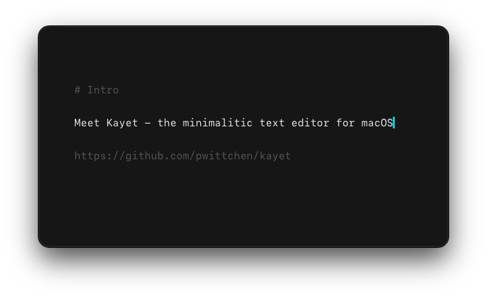

<div align="center">


# kayet

the minimalistic text editor for macOS

[getkayet.app](https://getkayet.app)

[](https://github.com/pwittchen/kayet/actions/workflows/rust.yml)

</div>

<p align="center">
  
</p>

## Opening files from the terminal

Run **kayet → Install ‘kayet’ Command** once (also in the command palette, `⌘K`), then:

```sh
kayet notes.md     # open a file (created if missing)
kayet .            # use the current folder as the workspace
```

`.md` and `.txt` files can also be opened from Finder via **Open With → kayet**.

See [SPEC.md](SPEC.md) for the full specification and [ROADMAP.md](ROADMAP.md) for planned work.

## Development

Requirements: Rust (edition 2024), Node.js 22+, macOS on Apple Silicon.

```sh
npm install
npm run tauri dev      # run with hot reload
npm run tauri build    # build kayet.app / .dmg
cargo test             # backend tests
npm test               # frontend tests (Vitest + happy-dom)
```

### Running in dev mode

```sh
npm install            # once, or after dependencies change
npm run tauri dev
```

This starts the Vite dev server on `http://localhost:1420` (port must be free), compiles the
Rust backend in debug mode and opens the kayet window pointing at the dev server.

- Changes in `ui/` (TypeScript, CSS) are hot-reloaded in the open window.
- Changes in `core/` (Rust, `tauri.conf.json`, capabilities) trigger a rebuild and an
  automatic restart of the app.
- Web inspector: right-click inside the editor → **Inspect Element**, or press `⌥⌘I`
  (debug builds only).
- Stop with `Ctrl+C` in the terminal.

Dev mode uses your real `~/.kayet` config and workspace. To experiment with a clean first
launch without touching them, point `HOME` somewhere else (keeping the Rust toolchain paths):

```sh
CARGO_HOME=~/.cargo RUSTUP_HOME=~/.rustup HOME=$(mktemp -d) npm run tauri dev
```

Layout: `core/` is the Rust backend (Tauri commands, config, workspace watcher,
Markdown rendering), `ui/` is the TypeScript frontend (CodeMirror 6 editor, file tree,
preview, hover chrome).

Configuration lives in `~/.kayet/config.toml`; the default workspace is `~/.kayet/workspace/`.

### Performance checks

`scripts/bench.mjs` checks the performance targets from [SPEC.md §13](SPEC.md) against a
real release build:

| Check | What is measured | Target |
|---|---|---|
| Cold start | process launch → first paint of the UI (median of all runs) | < 350ms |
| Opening a 5MB file | longest frame while a 5MB text file loads (worst run) | < 100ms (no UI freeze) |
| Preview render | re-rendering the preview of a ~50KB Markdown document (median) | < 16ms |

Build the release binary first (the benchmark needs the embedded frontend, so a plain
`cargo build` is not enough), then run the benchmark:

```sh
npx tauri build --no-bundle   # builds dist/ and target/release/kayet
npm run bench
```

Options (pass them after `--`):

```sh
npm run bench -- --runs 10              # number of app launches (default 5)
npm run bench -- --build                # build the release binary first
npm run bench -- --app path/to/kayet    # benchmark another binary, e.g. from a .app bundle
```

Each run launches kayet with `KAYET_BENCH` set: the app opens the generated test files,
measures itself, prints the results and quits. Runs use a throwaway `HOME`, so your
`~/.kayet` config, session and workspace are not touched. Example output:

```
kayet performance (5 runs, target/release/kayet)

PASS  Cold start → first paint         347.0ms  (target < 350ms)
      median of 5; first 671.0ms, max 671.0ms; webview up after 238.0ms
PASS  Open 5MB file: longest frame      28.0ms  (target < 100ms)
      worst of 5; open → painted median 26.0ms
PASS  Preview render (48KB)             15.0ms  (target < 16ms)
      median of 250; p95 17.0ms; Markdown → HTML (incl. IPC) 2.0ms
```

The detail lines help narrow down a regression: "webview up after" is how long it takes
until the web view starts loading (the rest of cold start is frontend init), and
"Markdown → HTML" is the Rust rendering part of the preview time. The script exits with
a non-zero status if any target is missed.

Tips for reliable numbers:

- Keep the kayet window visible while the benchmark runs; macOS renders no frames for
  hidden windows, and the run then fails with "no frames rendered".
- Close heavy apps and plug in the power adapter; the first launch after a build is
  usually slower (cold disk and web view caches), which is why the median is reported.
- Timings are rounded to 1ms by WebKit.

### Releasing

Pushing a version tag triggers `.github/workflows/release.yml`:

```sh
git tag v0.2.0 && git push origin v0.2.0
```

The workflow bumps the version in `core/Cargo.toml`, `Cargo.lock`, `core/tauri.conf.json`,
`package.json` and `package-lock.json` to match the tag (committed to `master`). It then
builds `kayet.app` and signs it with the Developer ID (hardened runtime,
`core/entitlements.plist`). The app is notarized with `notarytool` and stapled, packaged
into `kayet-macos-aarch64.dmg` (which is signed, notarized and stapled too), and published
to GitHub Releases with a changelog of the commits since the previous tag. Regular CI
builds (`rust.yml`) stay unsigned.

The workflow needs these repository secrets: `MACOS_CERTIFICATE` (base64-encoded Developer ID
Application `.p12`), `MACOS_CERTIFICATE_PASSWORD`, `KEYCHAIN_PASSWORD` (any random string),
`APPLE_SIGNING_IDENTITY` (e.g. `Developer ID Application: Name (TEAMID)`), `APPLE_ID`,
`APPLE_PASSWORD` (an app-specific password) and `APPLE_TEAM_ID`.
